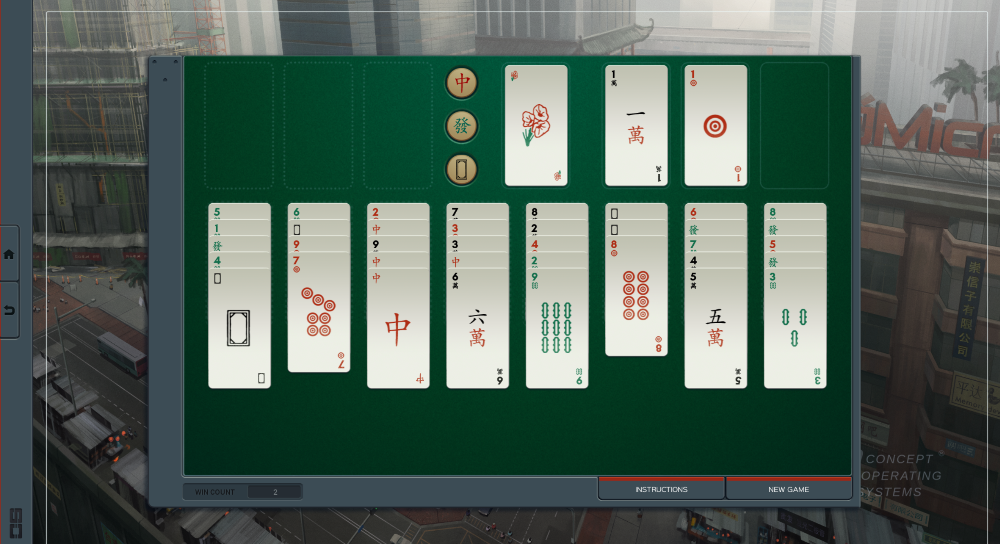
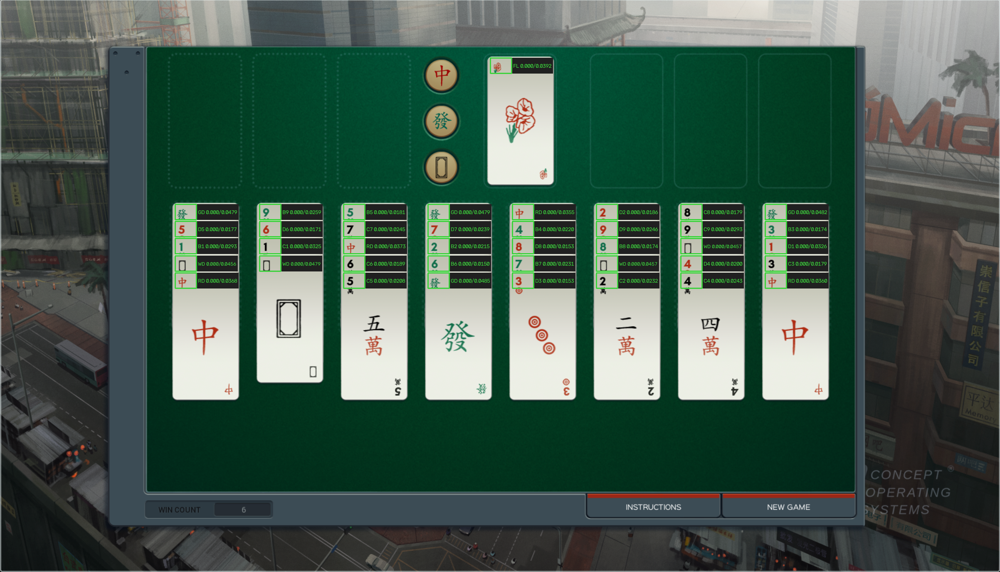

# SHENZHEN I/O Solitaire solver

A command-line solver for SHENZHEN I/O Solitaire. It can solve the bundled
example deal without third-party dependencies or recognize a game directly
from a screenshot using the optional OpenCV-based recognizer.

## Vision at a glance

The recognizer uses this bundled calibration screenshot to learn 31 visual
classes from a known deal. For each card, it extracts a normalized feature from
the rank-and-suit corner instead of comparing the entire card face.



When reading a new screenshot, the recognizer locates the green playfield,
scales the expected layout to match it, and labels each detected card corner.
The debug output below shows each prediction and its match-distance score;
lower scores are better, and green boxes are within the acceptance threshold.



## Requirements

- Python 3.10 or newer
- [`uv`](https://docs.astral.sh/uv/) (recommended), or `pip`
- The optional `ocr` dependencies when solving from screenshots

## Installation

Run the dependency-free solver directly from a checkout. The console command
and Python module entry point are equivalent:

```console
uv run shenzhen-solitaire
uv run python -m shenzhen_solitaire
```

Include the optional OCR dependencies when recognizing a screenshot:

```console
uv run --extra ocr shenzhen-solitaire path/to/screenshot.png
```

For the equivalent editable installation with `pip`, create a virtual
environment:

```console
python -m venv .venv
```

Activate it for the current shell:

```powershell
# Windows PowerShell
.venv\Scripts\Activate.ps1
```

```console
# Linux, macOS, or WSL
source .venv/bin/activate
```

Then install and run the project:

```console
python -m pip install -e ".[ocr]"
shenzhen-solitaire path/to/screenshot.png
```

Omit `[ocr]` when only the dependency-free solver is needed.

## Solving a screenshot

Capture the full green playfield with all tableau columns and the top row
visible. Window movement, cropping, and uniform scaling are supported, but the
game theme and card artwork should match the reference image.

```console
uv run --extra ocr shenzhen-solitaire path/to/screenshot.png
```

The command prints the recognized columns first, followed by the manual moves
and any automatic moves triggered by each action. Limit the search when
experimenting with difficult deals:

```console
uv run --extra ocr shenzhen-solitaire screenshot.png --max-states 1000000
```

When no solution comes back, the two possible reasons are reported differently,
because only one of them is worth retrying. A search that runs out of budget
reports how far it got and suggests a larger `--max-states`; a search that
exhausts every reachable position reports the deal as unsolvable and suggests
nothing, since a larger budget would return the same answer.

Memory is worth watching. `--max-states` bounds how many positions are
*expanded*, but every position *discovered* is retained, and that is between
one and roughly eight times as many depending on how the deal branches. At
about 1.45 KB per retained position, a million-state budget can mean anywhere
from 1.5 GB to well over 8 GB. The retry hint estimates from what the run
actually retained rather than from the budget.

## Reference image

The package includes `shenzhen_reference.png`, which is used automatically.
It contains every card face in a known deal so the recognizer can build visual
templates for the current game theme.

Supply a different calibration screenshot with `--reference`:

```console
uv run --extra ocr shenzhen-solitaire screenshot.png \
  --reference path/to/shenzhen_reference.png
```

A replacement reference must show the same known calibration deal represented
by `_REFERENCE_COLUMNS` in `shenzhen_solitaire/vision.py`. If the deal differs,
update that label map to match its tableau from bottom to top.

## Debug images

Use `--debug-image` to save an annotated copy of the screenshot:

```console
uv run --extra ocr shenzhen-solitaire screenshot.png \
  --debug-image runs/screenshot_debug.png
```

Each detected card is labeled with its predicted card and match score. Green
boxes are within the confidence threshold; red boxes indicate low-confidence
matches. The debug image is written before a low-confidence recognition error
is reported, so it can be used to diagnose a failed run. `runs/` is intended
as a local scratch directory; its generated screenshots and debug images are
ignored by Git.

## Development

Run the tests and code-quality checks with:

```console
uv run --extra ocr python -m unittest discover -s test -v
uv run ruff check .
uv run ruff format --check .
```

The OCR integration test skips automatically when the optional dependencies
are not installed.

Solutions are returned as `Move` objects rather than strings, so a solution can
be replayed and checked rather than only printed:

```python
from shenzhen_solitaire import apply_move, normalize_automatic_moves, solve

solution, explored = solve(state)

# solve() works from the normalized position, so a replay has to start there
# too, and re-normalize after each manual move to absorb the auto-play.
state, _ = normalize_automatic_moves(state)
for move, automatic in solution:
    state = apply_move(state, move)  # raises IllegalMove if the move is not legal
    state, _ = normalize_automatic_moves(state)
    print(move)  # renders as "C4/B3 C8 -> C3"
```

The test suite uses exactly this to verify that every solution it produces is
legal and actually wins, since `apply_move` checks the rules independently of
the code that generates candidate moves.

## License

MIT. See [LICENSE](LICENSE).
